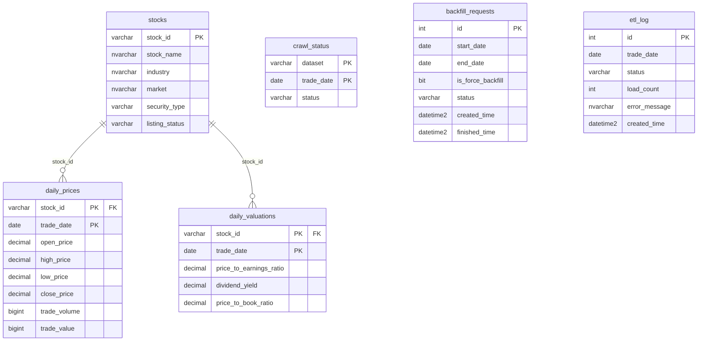

# StockLab ER Diagram

依目前 `sql/ddl/` 的結構繪製。`daily_prices` 與 `daily_valuations` 的主鍵為 `(stock_id, trade_date)`，`stock_id` 同時外鍵參照 `stocks`。`crawl_status`、`backfill_requests`、`etl_log` 彼此無外鍵。

```mermaid
erDiagram
    stocks ||--o{ daily_prices : "stock_id"
    stocks ||--o{ daily_valuations : "stock_id"

    stocks {
        varchar stock_id PK
        nvarchar stock_name
        nvarchar industry
        nvarchar market
        varchar security_type
        varchar listing_status
    }

    daily_prices {
        varchar stock_id PK "FK"
        date trade_date PK
        decimal open_price
        decimal high_price
        decimal low_price
        decimal close_price
        bigint trade_volume
        bigint trade_value
    }

    daily_valuations {
        varchar stock_id PK "FK"
        date trade_date PK
        decimal price_to_earnings_ratio
        decimal dividend_yield
        decimal price_to_book_ratio
    }

    crawl_status {
        varchar dataset PK
        date trade_date PK
        varchar status
    }

    backfill_requests {
        int id PK
        date start_date
        date end_date
        bit is_force_backfill
        varchar status
        datetime2 created_time
        datetime2 finished_time
    }

    etl_log {
        int id PK
        date trade_date
        varchar status
        int load_count
        nvarchar error_message
        datetime2 created_time
    }
```
